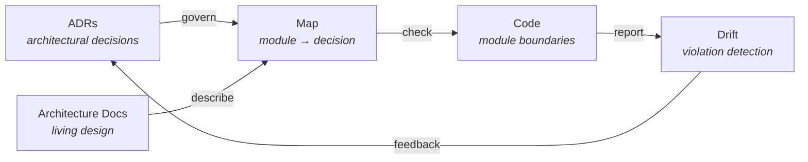
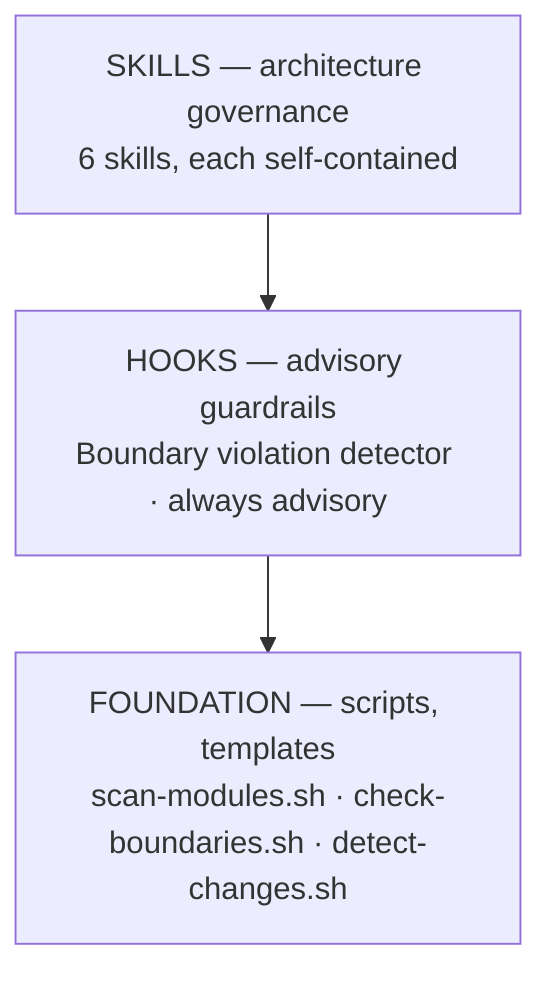

<p align="center">
  <strong>principled-architecture</strong>
</p>

<p align="center">
  <em>Close the governance feedback loop from ADRs to code.</em>
</p>

<p align="center">
  
  
  
  
</p>

---

A Claude Code plugin that creates a **governance feedback loop** from architectural decisions back to the codebase. It maps modules to ADRs and architecture documents, detects architectural drift, audits decision coverage, keeps architecture documents synchronized, and answers architecture questions.

## The Governance Model



**ADRs and architecture docs drive governance.** Code is checked against documentation, not the other way around.

## Quick Start

```bash
# Install the plugin
claude plugin add <path-to-principled-architecture>

# Generate an architecture map
/arch-map

# Detect architectural drift
/arch-drift --strict

# Audit governance coverage
/arch-audit

# Sync an architecture doc with reality
/arch-sync --doc docs/architecture/plugin-system.md

# Ask an architecture question
/arch-query "Which ADRs govern the plugin system?"
```

## Skills

6 skills, each a slash command. Each skill is self-contained --- its own templates, scripts, and reference docs.

### Architecture Governance

| Command                                         | Description                                                     |
| ----------------------------------------------- | --------------------------------------------------------------- |
| `/arch-map [--module <path>] [--output <path>]` | Map modules to governing ADRs and architecture docs             |
| `/arch-drift [--module <path>] [--strict]`      | Detect dependency direction violations and architectural drift  |
| `/arch-audit [--module <path>]`                 | Audit governance coverage --- find ungoverned modules           |
| `/arch-sync [--doc <path>] [--all]`             | Sync architecture docs with codebase state                      |
| `/arch-query "<question>"`                      | Answer architecture questions via cross-reference and synthesis |

### Background Knowledge

`arch-strategy` --- not directly invocable. Gives Claude Code deep understanding of dependency direction rules, governance mapping conventions, heuristic analysis approach (ADR-014), and module type system (ADR-003). Activates automatically when working with architecture governance.

## Enforcement Hooks

One advisory hook --- no manual action required.

| Hook                            | Trigger             | Behavior                                                                                    |
| ------------------------------- | ------------------- | ------------------------------------------------------------------------------------------- |
| **Boundary Violation Advisory** | PostToolUse `Write` | Advisory warning when a written file contains imports violating dependency direction rules. |

## Architecture

The plugin is built in three layers:



### Module Dependency Direction Rules

Based on ADR-003's module type declarations and ADR-014's heuristic governance approach:

| Module Type | Can Depend On     | Cannot Depend On                     |
| ----------- | ----------------- | ------------------------------------ |
| `app`       | `lib`, `core`     | other `app`                          |
| `lib`       | `core`            | `app`, other `lib` (unless declared) |
| `core`      | _(none internal)_ | `app`, `lib`                         |

Teams override defaults by declaring explicit dependencies in their module's `CLAUDE.md` `## Dependencies` section.

### Coverage Classification

| Level       | Criteria                                                               |
| ----------- | ---------------------------------------------------------------------- |
| **Full**    | At least one governing ADR AND at least one architecture doc reference |
| **Partial** | Has governing ADRs OR architecture doc references, but not both        |
| **None**    | No governing ADRs and no architecture doc references                   |

### Heuristic Analysis (ADR-014)

Drift detection uses file-level pattern matching (regex on import statements), not AST-level parsing. This preserves the principled methodology's language-agnostic property:

- Works across JavaScript, TypeScript, Python, Go, Rust, Java
- Detects the highest-value violations (module boundary crossings)
- Advisory by default; `--strict` mode available for CI
- Complements, rather than replaces, language-specific static analysis tools

## CI Integration

### Template Drift Check

```yaml
- name: Check principled-architecture template drift
  run: bash plugins/principled-architecture/scripts/check-template-drift.sh
```

Exits non-zero if any script copy has diverged from canonical.

### Hook Smoke-test

```yaml
- name: Smoke-test boundary violation hook
  run: |
    # Test: writing a source file should produce advisory (exit 0)
    echo '{"tool_input":{"file_path":"src/index.ts"}}' \
      | bash plugins/principled-architecture/hooks/scripts/check-boundary-violation.sh
    # Test: writing a non-source file should pass silently (exit 0)
    echo '{"tool_input":{"file_path":"README.md"}}' \
      | bash plugins/principled-architecture/hooks/scripts/check-boundary-violation.sh
```

All must exit 0 --- the hook is advisory only.

## Prerequisites

- **Claude Code v2.1.3+** (skills/commands unification)
- **Bash** (all scripts are pure bash)
- **Git** (repository context, module discovery)
- **jq** (optional --- scripts fall back to grep-based extraction)

---

<p align="center">
  <sub>Built with the <a href="https://docs.anthropic.com/en/docs/claude-code">Claude Code</a> plugin system · Principled specification-first methodology</sub>
</p>
