<p align="center">
  <strong>📐 principled-docs</strong>
</p>

<p align="center">
  <em>Specification-first documentation for monorepos, powered by Claude Code.</em>
</p>

<p align="center">
  
  
  
  
</p>

---

A Claude Code plugin that **scaffolds**, **authors**, and **enforces** module documentation structure. Every module gets a consistent, audience-driven documentation set — from RFC proposals through immutable architectural decision records to DDD implementation plans.

## 🔭 The Pipeline

Every significant change follows three stages:

```mermaid
flowchart LR
    P["📋 <b>Proposal</b> (RFC)<br/><i>what &amp; why</i><br/><br/>Strategic · Mutable"]
    D["📌 <b>Decision</b> (ADR)<br/><i>what was decided</i><br/><br/>Permanent · Immutable*"]
    L["🗺️ <b>Plan</b> (DDD)<br/><i>how</i><br/><br/>Tactical · Mutable"]

    P --> D --> L
```



> \* Immutable except `superseded_by`

**Proposals** define intent. **Decisions** are the permanent record — immutable after acceptance. **Plans** decompose work via bounded contexts and aggregates to implement accepted decisions.

## ⚡ Quick Start

```bash
# Install the plugin
claude plugin add <path-to-principled-docs>

# Scaffold a new module
/scaffold packages/payment-gateway --type app

# Start the pipeline
/new-proposal switch-to-event-sourcing --module packages/payment-gateway
```

## 🛠️ Skills

9 skills, each a slash command. Each skill is self-contained — its own templates, scripts, and reference docs.

### Scaffolding & Validation

| Command                                  | Description                                                   |
| ---------------------------------------- | ------------------------------------------------------------- |
| `/scaffold <path> --type core\|lib\|app` | 🏗️ Generate complete documentation structure for a new module |
| `/scaffold --root`                       | 🏗️ Generate repo-level cross-cutting docs structure           |
| `/validate [path] --type <type>`         | ✅ Check documentation structure against the standard         |
| `/docs-audit`                            | 📊 Audit documentation health across all modules              |

### Authoring

| Command                                 | Description                                                   |
| --------------------------------------- | ------------------------------------------------------------- |
| `/new-proposal <title>`                 | 📋 Create a new RFC proposal                                  |
| `/new-plan <title> --from-proposal NNN` | 🗺️ Create a DDD implementation plan from an accepted proposal |
| `/new-adr <title>`                      | 📌 Create an Architectural Decision Record                    |
| `/new-architecture-doc <title>`         | 📐 Create a living architecture document                      |

### Lifecycle

| Command                           | Description                                                                           |
| --------------------------------- | ------------------------------------------------------------------------------------- |
| `/proposal-status <NNN> <status>` | 🔄 Transition a proposal through `draft → in-review → accepted\|rejected\|superseded` |

### Background Knowledge

`docs-strategy` — not directly invocable. Gives Claude Code deep understanding of the documentation strategy, naming conventions, lifecycle rules, and DDD decomposition. Activates automatically when working with docs.

## 🔒 Enforcement Hooks

Three hooks provide deterministic guardrails — no manual action required.

| Hook                         | Trigger                  | Behavior                                                                               |
| ---------------------------- | ------------------------ | -------------------------------------------------------------------------------------- |
| **ADR Immutability Guard**   | PreToolUse `Edit\|Write` | 🛡️ Blocks edits to accepted ADRs. Exception: `superseded_by` updates are allowed.      |
| **Proposal Lifecycle Guard** | PreToolUse `Edit\|Write` | 🛡️ Blocks edits to terminal proposals (`accepted`, `rejected`, `superseded`).          |
| **Structure Nudge**          | PostToolUse `Write`      | 💡 Advisory validation after file writes. Warns about missing structure. Never blocks. |

## 📂 Module Structure

Every module follows a consistent layout. The plugin scaffolds and validates this structure.

```
module/
├── docs/
│   ├── proposals/        📋 RFCs (NNN-short-title.md)
│   ├── plans/            🗺️  DDD implementation plans
│   ├── decisions/        📌 ADRs — immutable after acceptance
│   └── architecture/     📐 Living design documentation
├── README.md             📖 Module front door
├── CONTRIBUTING.md       🤝 Build/test/PR conventions
└── CLAUDE.md             🤖 AI development context
```

**Lib modules** add: `docs/examples/`, `INTERFACE.md`
**App modules** add: `docs/runbooks/`, `docs/integration/`, `docs/config/`

## 🔄 Full Pipeline Walkthrough

```bash
# 1. Create a proposal
/new-proposal switch-to-event-sourcing --module packages/payments

# 2. Write the proposal content, then move through lifecycle
/proposal-status 001 in-review
/proposal-status 001 accepted        # → prompts for ADR creation

# 3. Record architectural decisions
/new-adr use-kafka-for-event-store --from-proposal 001
/new-adr cqrs-read-model-strategy --from-proposal 001

# 4. Create an implementation plan (DDD decomposition, informed by ADRs)
/new-plan switch-to-event-sourcing --from-proposal 001

# 5. Document the resulting architecture
/new-architecture-doc event-sourcing-design --module packages/payments
```

## ⚙️ Configuration

Configure via `.claude/settings.json`:

```json
{
  "principled-docs": {
    "modulesDirectory": "packages",
    "defaultModuleType": "core",
    "docsSubdirectory": "docs",
    "strictMode": false,
    "customTemplatesPath": null,
    "ignoredModules": ["packages/deprecated-*"],
    "fileExtension": ".md"
  }
}
```

| Setting               | Default      | Description                                               |
| --------------------- | ------------ | --------------------------------------------------------- |
| `modulesDirectory`    | `"packages"` | Root directory containing modules                         |
| `defaultModuleType`   | `"core"`     | Fallback when type is not specified                       |
| `docsSubdirectory`    | `"docs"`     | Subdirectory within each module for docs                  |
| `strictMode`          | `false`      | Treat placeholder-only files as failures                  |
| `customTemplatesPath` | `null`       | Override all templates (full replacement, no inheritance) |
| `ignoredModules`      | `[]`         | Glob patterns for modules to skip                         |
| `fileExtension`       | `".md"`      | Extension for generated files                             |

## 🚀 CI Integration

### Structural Validation

```yaml
- name: Validate module docs structure
  run: |
    for module in packages/*/; do
      ./principled-docs/skills/scaffold/scripts/validate-structure.sh \
        --module-path "$module" --json >> results.json
    done
    ./principled-docs/skills/scaffold/scripts/validate-structure.sh \
      --root --json >> results.json
    jq -e '.[] | select(.status == "fail")' results.json && exit 1 || exit 0
```

### Template Drift Check

```yaml
- name: Check template drift
  run: ./principled-docs/skills/scaffold/scripts/check-template-drift.sh
```

Exits non-zero if any template copy has diverged from canonical.

## 🧩 Architecture

The plugin is built in three layers:

```mermaid
flowchart TB
    S["📋 <b>SKILLS</b> — generative workflows<br/>9 skills, each self-contained"]
    H["🛡️ <b>HOOKS</b> — deterministic guardrails<br/>ADR immutability · proposal lifecycle · nudge"]
    F["🧱 <b>FOUNDATION</b> — templates, scripts, manifest<br/>12 canonical templates · 4 utility scripts"]

    S --> H --> F
```



Templates are duplicated for skill self-containment. A CI drift check ensures copies never diverge from canonical.

---

<p align="center">
  <sub>Built with the <a href="https://docs.anthropic.com/en/docs/claude-code">Claude Code</a> plugin system · Principled specification-first methodology</sub>
</p>
