<p align="center">
  <strong>🔗 principled-github</strong>
</p>

<p align="center">
  <em>Integrate the Principled specification-first workflow with GitHub native features.</em>
</p>

<p align="center">
  
  
  
  
</p>

---

A Claude Code plugin that bridges the **Principled methodology** with **GitHub native features**. It maps proposals to issues, plans to tracking issues, tasks to PRs, and lifecycle stages to labels --- keeping principled documents as the source of truth while GitHub serves as the collaboration layer.

## 🔭 The Integration Model

```mermaid
flowchart LR
    P["📋 <b>Proposal</b> (RFC)<br/><i>what &amp; why</i>"]
    I["🐛 <b>Issue</b><br/><i>GitHub native</i>"]
    L["🏷️ <b>Labels</b><br/><i>lifecycle state</i>"]
    PR["🔀 <b>Pull Request</b><br/><i>implementation</i>"]

    P -->|sync| I
    P -->|status| L
    I -->|ingest| P
    L -->|track| PR
```



**Documents are always the source of truth.** GitHub issues and PRs reference principled documents --- never the reverse.

## ⚡ Quick Start

```bash
# Install the plugin
claude plugin add <path-to-principled-github>

# Scaffold GitHub configuration files
/gh-scaffold --all

# Sync labels to GitHub
/sync-labels

# Triage all open issues into the principled pipeline
/triage

# Or ingest a single issue
/ingest-issue 42

# Sync a proposal to a GitHub issue
/sync-issues docs/proposals/001-my-feature.md

# Generate a PR description from a plan task
/pr-describe 1.1

# Validate a PR follows conventions
/pr-check 42

# Generate CODEOWNERS from module structure
/gen-codeowners
```

## 🛠️ Skills

10 skills, each a slash command. Each skill is self-contained --- its own templates, scripts, and reference docs.

### Triage & Ingestion

| Command                                  | Description                                               |
| ---------------------------------------- | --------------------------------------------------------- |
| `/triage [--limit N] [--label <filter>]` | 📥 Batch-process open issues into the principled pipeline |
| `/ingest-issue <number>`                 | 📋 Pull a single GitHub issue into the pipeline as docs   |

### Sync

| Command                                  | Description                                           |
| ---------------------------------------- | ----------------------------------------------------- |
| `/sync-issues [<doc>] [--all-proposals]` | 🔄 Sync proposals/plans to GitHub issues              |
| `/sync-labels [--dry-run] [--prune]`     | 🏷️ Create and sync GitHub labels for lifecycle stages |

### Generation

| Command                                            | Description                                              |
| -------------------------------------------------- | -------------------------------------------------------- |
| `/pr-describe [<task-id>] [--plan <path>]`         | 📝 Generate structured PR description from a plan task   |
| `/gh-scaffold [--templates] [--workflows] [--all]` | 🏗️ Scaffold .github/ directory with principled templates |
| `/gen-codeowners [--modules-dir <path>]`           | 👥 Generate CODEOWNERS from module structure             |

### Validation

| Command                              | Description                                   |
| ------------------------------------ | --------------------------------------------- |
| `/pr-check [<pr-number>] [--strict]` | ✅ Validate PR follows principled conventions |

### Background Knowledge

`github-strategy` --- not directly invocable. Gives Claude Code deep understanding of the GitHub-principled mapping model, label taxonomy, and template conventions. Activates automatically when working with GitHub integration.

## 🔒 Enforcement Hooks

One advisory hook --- no manual action required.

| Hook                   | Trigger            | Behavior                                                                                |
| ---------------------- | ------------------ | --------------------------------------------------------------------------------------- |
| **PR Reference Nudge** | PostToolUse `Bash` | 💡 Advisory reminder when `gh pr create` is run without principled document references. |

## 🏗️ Architecture

The plugin is built in three layers:

```mermaid
flowchart TB
    S["🛠️ <b>SKILLS</b> — integration workflows<br/>10 skills, each self-contained"]
    H["🔒 <b>HOOKS</b> — advisory guardrails<br/>PR reference nudge · always advisory"]
    F["🧱 <b>FOUNDATION</b> — scripts, templates<br/>1 canonical script · issue/PR/workflow templates"]

    S --> H --> F
```



### Label Taxonomy

The plugin defines a complete label set for principled workflows:

| Group        | Labels                                                                                                  |
| ------------ | ------------------------------------------------------------------------------------------------------- |
| **Proposal** | `proposal:draft`, `proposal:in-review`, `proposal:accepted`, `proposal:rejected`, `proposal:superseded` |
| **Plan**     | `plan:active`, `plan:complete`, `plan:abandoned`                                                        |
| **Decision** | `decision:proposed`, `decision:accepted`, `decision:deprecated`, `decision:superseded`                  |
| **Task**     | `task:in-progress`, `task:validating`, `task:passed`, `task:failed`, `task:merged`, `task:abandoned`    |
| **Type**     | `type:rfc`, `type:adr`, `type:plan`, `type:arch`                                                        |
| **Workflow** | `ready-for-review`, `needs-discussion`, `blocked`, `automated`                                          |

### GitHub Templates

The `/gh-scaffold` skill creates:

| File                                        | Purpose                               |
| ------------------------------------------- | ------------------------------------- |
| `.github/ISSUE_TEMPLATE/proposal.yml`       | Structured issue template for RFCs    |
| `.github/ISSUE_TEMPLATE/plan.yml`           | Tracking issue template for DDD plans |
| `.github/ISSUE_TEMPLATE/bug-report.yml`     | Standard bug report template          |
| `.github/ISSUE_TEMPLATE/config.yml`         | Issue template chooser configuration  |
| `.github/pull_request_template.md`          | PR template with principled sections  |
| `.github/workflows/principled-pr-check.yml` | PR validation workflow                |
| `.github/workflows/principled-labels.yml`   | Label sync workflow                   |

## 🔄 Script Duplication

Following the principled convention, shared scripts are duplicated across consuming skills with byte-identical copies. A drift check verifies all copies match:

```bash
bash plugins/principled-github/scripts/check-template-drift.sh
```

| Canonical                             | Copies To                                                                       |
| ------------------------------------- | ------------------------------------------------------------------------------- |
| `sync-issues/scripts/check-gh-cli.sh` | `sync-labels/`, `pr-check/`, `gh-scaffold/`, `ingest-issue/`, `triage/` scripts |

## 🚀 CI Integration

### Template Drift Check

```yaml
- name: Check principled-github template drift
  run: bash plugins/principled-github/scripts/check-template-drift.sh
```

Exits non-zero if any script copy has diverged from canonical.

### Hook Smoke-test

```yaml
- name: Smoke-test PR reference hook
  run: |
    # Test: gh pr create command without references should warn (exit 0)
    echo '{"tool_input":{"command":"gh pr create --title test --body test"}}' \
      | bash plugins/principled-github/hooks/scripts/check-pr-references.sh
    # Test: unrelated command should pass silently (exit 0)
    echo '{"tool_input":{"command":"git status"}}' \
      | bash plugins/principled-github/hooks/scripts/check-pr-references.sh
```

Both must exit 0 --- the hook is advisory only.

## 📦 Prerequisites

- **Claude Code v2.1.3+** (skills/commands unification)
- **Bash** (all scripts are pure bash)
- **Git** (repository context)
- **gh CLI** (GitHub API access --- required for sync, label, and PR operations)
- **jq** (optional --- scripts fall back to grep-based extraction)

---

<p align="center">
  <sub>Built with the <a href="https://docs.anthropic.com/en/docs/claude-code">Claude Code</a> plugin system · Principled specification-first methodology</sub>
</p>
