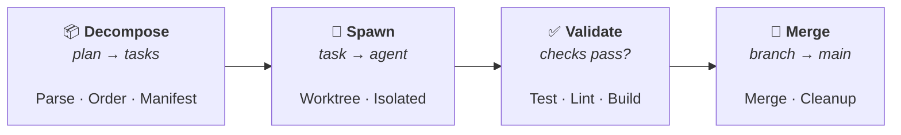
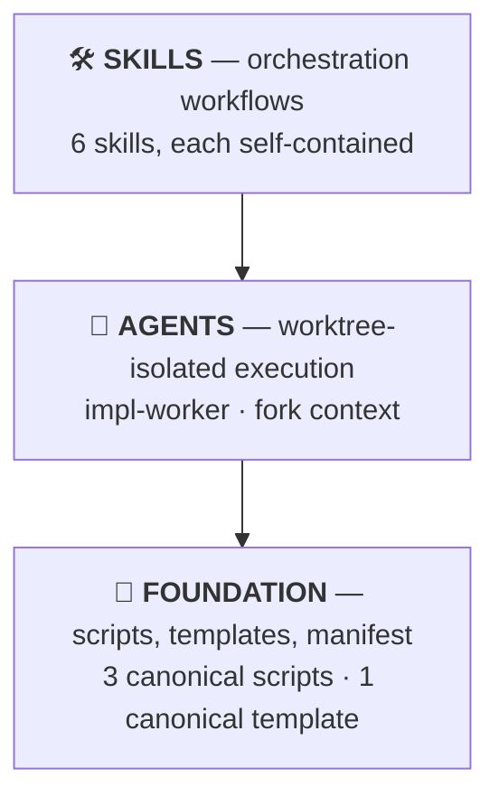

<p align="center">
  <strong>🚀 principled-implementation</strong>
</p>

<p align="center">
  <em>Orchestrate DDD plan execution via worktree-isolated Claude Code agents.</em>
</p>

<p align="center">
  
  
  
  
</p>

---

A Claude Code plugin that bridges the gap between **planning** and **execution** in specification-first development. It reads DDD implementation plans generated by the [principled-docs](../principled-docs/) plugin and automates their execution — decomposing tasks, spawning isolated agents, validating results, and merging work back.

## 🔭 The Lifecycle

Every plan follows four stages:


```mermaid
flowchart LR
    D["📦 <b>Decompose</b><br/><i>plan → tasks</i><br/><br/>Parse · Order · Manifest"]
    S["🚀 <b>Spawn</b><br/><i>task → agent</i><br/><br/>Worktree · Isolated"]
    V["✅ <b>Validate</b><br/><i>checks pass?</i><br/><br/>Test · Lint · Build"]
    M["🔀 <b>Merge</b><br/><i>branch → main</i><br/><br/>Merge · Cleanup"]

    D --> S --> V --> M
```

**Decompose** extracts tasks from a DDD plan. **Spawn** executes each in an isolated git worktree. **Validate** runs project checks. **Merge** integrates the result and cleans up.

## ⚡ Quick Start

```bash
# Install the plugin
claude plugin add <path-to-principled-implementation>

# Or run the full pipeline automatically
/orchestrate docs/plans/003-new-feature.md

# Step-by-step alternative:
/decompose docs/plans/003-new-feature.md   # extract tasks
/spawn 1.1                                  # execute a task
/check-impl --task 1.1                      # validate it
/merge-work 1.1                             # merge back
```

## 🛠️ Skills

6 skills, each a slash command. Each skill is self-contained — its own templates, scripts, and reference docs.

### Orchestration

| Command                                             | Description                                                       |
| --------------------------------------------------- | ----------------------------------------------------------------- |
| `/orchestrate <plan-path> [--phase N] [--continue]` | 🎯 Full automated lifecycle: decompose → spawn → validate → merge |
| `/spawn <task-id>`                                  | 🚀 Execute a task in an isolated worktree via impl-worker agent   |
| `/merge-work <task-id> [--force] [--no-cleanup]`    | 🔀 Merge a validated task's branch and clean up                   |

### Analysis

| Command                             | Description                                        |
| ----------------------------------- | -------------------------------------------------- |
| `/decompose <plan-path>`            | 📦 Extract tasks from a DDD plan into a manifest   |
| `/check-impl [--task <id>] [--all]` | ✅ Validate implementations against project checks |

### Background Knowledge

`impl-strategy` — not directly invocable. Gives Claude Code deep understanding of the orchestration strategy, task lifecycle, manifest schema, and worktree isolation model. Activates automatically when working with implementations.

## 🤖 Agents

| Agent         | Isolation  | maxTurns | Memory  | Description                                                    |
| ------------- | ---------- | -------- | ------- | -------------------------------------------------------------- |
| `impl-worker` | `worktree` | 100      | project | Executes a single task from a DDD plan in an isolated worktree |

The `spawn` skill delegates to `impl-worker` via `context: fork` + `agent: impl-worker` frontmatter. Each agent gets its own git worktree, creates a named branch (`impl/<plan-number>/<task-id>`), implements the task, and commits.

The agent uses `memory: project` to accumulate implementation patterns across sessions. A scoped `Stop` hook validates that the worker properly updated task status before finishing.

### Agent Teams (Experimental)

When `CLAUDE_CODE_EXPERIMENTAL_AGENT_TEAMS=1` is set, `/orchestrate` uses agent teams for parallel task execution within phases. See the [orchestration guide](skills/impl-strategy/reference/orchestration-guide.md) for details.

## 🔒 Enforcement Hooks

Five hooks across five event types — no manual action required.

| Hook                            | Trigger                  | Behavior                                                                              |
| ------------------------------- | ------------------------ | ------------------------------------------------------------------------------------- |
| **Manifest Integrity Advisory** | PreToolUse `Edit\|Write` | 💡 Warns when `.impl/manifest.json` is edited directly. Advisory only — never blocks. |
| **Worktree Setup**              | WorktreeCreate           | 💡 Initializes `.impl/` in new worktrees with manifest reference. Advisory.           |
| **Worktree Cleanup**            | WorktreeRemove           | 💡 Archives logs and state when worktrees are removed. Advisory.                      |
| **Worker Completion Validator** | SubagentStop             | 🛡️ Blocks impl-worker completion if tasks are orphaned in `in_progress`.              |
| **Task Completion Gate**        | TaskCompleted            | 🛡️ Blocks task completion when quality checks haven't passed (agent teams only).      |

## 🏗️ Architecture

The plugin is built in three layers:


```mermaid
flowchart TB
    S["🛠️ <b>SKILLS</b> — orchestration workflows<br/>6 skills, each self-contained"]
    A["🤖 <b>AGENTS</b> — worktree-isolated execution<br/>impl-worker · fork context"]
    F["🧱 <b>FOUNDATION</b> — scripts, templates, manifest<br/>3 canonical scripts · 1 canonical template"]

    S --> A --> F
```

### Worktree Isolation

```
/orchestrate (inline)
  ├── Decompose plan → .impl/manifest.json
  ├── For each phase (sequential):
  │   ├── For each task:
  │   │   ├── /spawn <task-id> → impl-worker agent (worktree)
  │   │   ├── /check-impl → run project checks
  │   │   └── /merge-work → merge branch, cleanup
  │   └── Phase complete
  └── Final summary
```

Key constraints:

- **Subagents cannot spawn subagents.** The orchestrator runs inline to coordinate multiple `/spawn` calls sequentially.
- **Worktree agents cannot access main worktree files.** Task details are embedded in the agent prompt via `!` backtick pre-fork commands.
- **The manifest tracks all state.** `.impl/manifest.json` is managed by scripts and the orchestrator — not by worktree agents.

### Error Recovery

- **Failed checks**: retry up to 2 times with failure context
- **Merge conflicts**: pause for manual resolution, resume with `--continue`
- **Interrupted**: resume from manifest state with `--continue`

## 🔄 Shared Code

All shared code lives in `lib/` with one copy each, referenced as
`${CLAUDE_PLUGIN_ROOT}/lib/<name>` (ADR-018):

| File                           | Used by                                               |
| ------------------------------ | ----------------------------------------------------- |
| `lib/task-manifest.sh`         | decompose, spawn, check-impl, merge-work, orchestrate |
| `lib/parse-plan.sh`            | decompose, spawn, orchestrate                         |
| `lib/run-checks.sh`            | check-impl, orchestrate                               |
| `lib/templates/claude-task.md` | spawn, orchestrate                                    |

There is no drift checker: with one copy, drift is impossible rather than detected.
`scripts/check-skill-references.sh` verifies every reference resolves.

## 🚀 CI Integration

### Reference Integrity Check

```yaml
- name: Check skill and hook script references resolve
  run: bash scripts/check-skill-references.sh
```

Exits non-zero if a SKILL.md references a script that does not exist.

### Hook Smoke-test

```yaml
- name: Smoke-test manifest integrity hook
  run: |
    echo '{"tool_input":{"file_path":".impl/manifest.json"}}' \
      | bash plugins/principled-implementation/hooks/scripts/check-manifest-integrity.sh
    echo '{"tool_input":{"file_path":"src/index.ts"}}' \
      | bash plugins/principled-implementation/hooks/scripts/check-manifest-integrity.sh
```

Both must exit 0 — the hook is advisory only.

## 📦 Dependencies

- **Claude Code v2.1.3+** (skills, agents, worktree isolation)
- **Bash** (all scripts are pure bash)
- **Git** (worktree management)
- **jq** (optional — scripts fall back to grep/sed)

---

<p align="center">
  <sub>Built with the <a href="https://docs.anthropic.com/en/docs/claude-code">Claude Code</a> plugin system · Principled specification-first methodology</sub>
</p>
