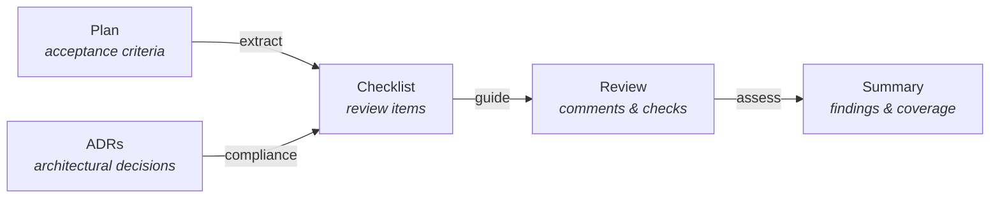
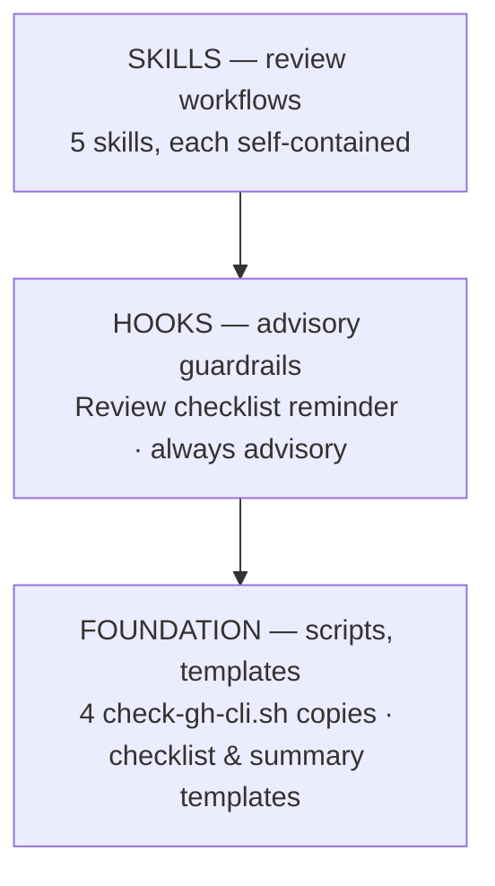

<p align="center">
  <strong>principled-quality</strong>
</p>

<p align="center">
  <em>Connect code reviews to the principled documentation pipeline.</em>
</p>

<p align="center">
  
  
  
  
</p>

---

A Claude Code plugin that bridges the **Principled methodology** with **code review workflows**. It generates spec-driven review checklists from plan acceptance criteria and relevant ADRs, surfaces specification context for reviewers, assesses review coverage, and produces structured review summaries.

## The Review Model



**Plans and ADRs drive the review.** Checklists are generated from specifications, not ad hoc reviewer judgment alone.

## Quick Start

```bash
# Install the plugin
claude plugin add <path-to-principled-quality>

# Generate a review checklist for a PR
/review-checklist 42 --plan docs/plans/005-feature.md

# Surface specification context for a PR
/review-context 42

# Assess review coverage against the checklist
/review-coverage 42

# Generate a structured review summary
/review-summary 42
```

## Skills

5 skills, each a slash command. Each skill is self-contained --- its own templates, scripts, and reference docs.

### Review Workflow

| Command                                                | Description                                                 |
| ------------------------------------------------------ | ----------------------------------------------------------- |
| `/review-checklist <pr> [--plan <path>] [--task <id>]` | Generate spec-driven review checklist from plan and ADRs    |
| `/review-context <pr>`                                 | Surface proposals, plans, and ADRs relevant to PR's changes |
| `/review-coverage <pr>`                                | Assess review completeness against checklist items          |
| `/review-summary <pr>`                                 | Generate structured review summary with findings table      |

### Background Knowledge

`quality-strategy` --- not directly invocable. Gives Claude Code deep understanding of review standards, checklist categories, severity classification, and the dual storage model. Activates automatically when working with review workflows.

## Enforcement Hooks

One advisory hook --- no manual action required.

| Hook                          | Trigger            | Behavior                                                                                  |
| ----------------------------- | ------------------ | ----------------------------------------------------------------------------------------- |
| **Review Checklist Advisory** | PostToolUse `Bash` | Advisory reminder when `gh pr review` or `gh pr merge` is run without a review checklist. |

## Architecture

The plugin is built in three layers:



### Dual Storage (ADR-012)

Review checklists use dual storage:

| Location                   | Role                   | Interface             |
| -------------------------- | ---------------------- | --------------------- |
| **PR comments**            | Primary — interactive  | Reviewers check items |
| **`.review/` local files** | Secondary — persistent | Git-trackable history |

PR comments are the working copy. Local files are the audit trail. `.review/` is gitignored by default --- teams opt in to version control.

### Checklist Categories

| Category                | Source                  | Purpose                             |
| ----------------------- | ----------------------- | ----------------------------------- |
| **Acceptance Criteria** | Plan task definitions   | Verify implementation meets spec    |
| **ADR Compliance**      | Relevant ADRs by module | Verify architectural decisions held |
| **General Quality**     | Standard quality checks | Catch common issues                 |

### Severity Classification

| Severity      | Meaning                              | Action Required       |
| ------------- | ------------------------------------ | --------------------- |
| **Blocking**  | Required criterion not met           | Must fix before merge |
| **Important** | ADR violation or significant concern | Should fix            |
| **Advisory**  | Suggestion for improvement           | Author's discretion   |

## Script Duplication

Following the principled convention, shared scripts are duplicated across consuming skills with byte-identical copies. This plugin uses **cross-plugin drift detection** --- the canonical `check-gh-cli.sh` lives in principled-github.

```bash
bash plugins/principled-quality/scripts/check-template-drift.sh
```

| Canonical (principled-github)         | Copies To (principled-quality)                                                        |
| ------------------------------------- | ------------------------------------------------------------------------------------- |
| `sync-issues/scripts/check-gh-cli.sh` | `review-checklist/`, `review-context/`, `review-coverage/`, `review-summary/` scripts |

## CI Integration

### Template Drift Check

```yaml
- name: Check principled-quality template drift
  run: bash plugins/principled-quality/scripts/check-template-drift.sh
```

Exits non-zero if any script copy has diverged from the cross-plugin canonical.

### Hook Smoke-test

```yaml
- name: Smoke-test review checklist hook
  run: |
    # Test: gh pr review command should warn (exit 0)
    echo '{"tool_input":{"command":"gh pr review 42"}}' \
      | bash plugins/principled-quality/hooks/scripts/check-review-checklist.sh
    # Test: gh pr merge command should warn (exit 0)
    echo '{"tool_input":{"command":"gh pr merge 42"}}' \
      | bash plugins/principled-quality/hooks/scripts/check-review-checklist.sh
    # Test: unrelated command should pass silently (exit 0)
    echo '{"tool_input":{"command":"git status"}}' \
      | bash plugins/principled-quality/hooks/scripts/check-review-checklist.sh
```

All must exit 0 --- the hook is advisory only.

## Prerequisites

- **Claude Code v2.1.3+** (skills/commands unification)
- **Bash** (all scripts are pure bash)
- **Git** (repository context)
- **gh CLI** (GitHub API access --- required for PR interaction)
- **jq** (optional --- scripts fall back to grep-based extraction)

---

<p align="center">
  <sub>Built with the <a href="https://docs.anthropic.com/en/docs/claude-code">Claude Code</a> plugin system · Principled specification-first methodology</sub>
</p>
