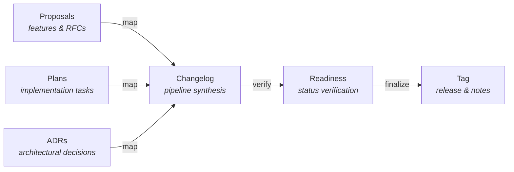
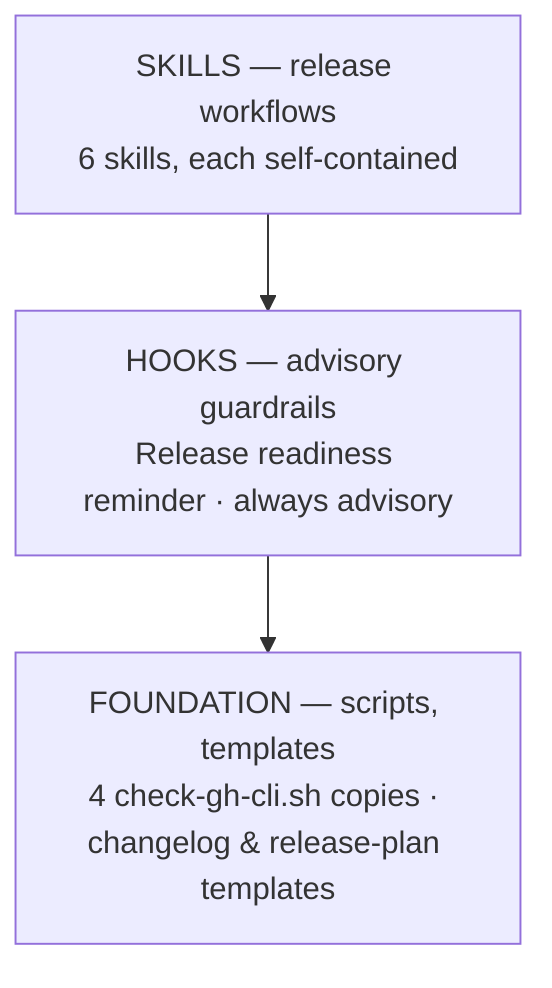

<p align="center">
  <strong>principled-release</strong>
</p>

<p align="center">
  <em>Bridge the principled documentation pipeline to the delivery boundary.</em>
</p>

<p align="center">
  
  
  
  
</p>

---

A Claude Code plugin that extends the **Principled methodology** through the **release boundary**. It generates changelogs from proposals, plans, and ADRs, verifies release readiness against pipeline document statuses, coordinates version bumps across monorepo modules, and governs the release lifecycle from planning through tagging.

## The Release Model



**Pipeline documents drive the release.** Changelogs are generated from specifications, not commit messages alone (ADR-013).

## Quick Start

```bash
# Install the plugin
claude plugin add <path-to-principled-release>

# Generate a changelog since the last tag
/changelog --since v0.3.1

# Check release readiness
/release-ready --strict

# Coordinate version bumps
/version-bump --type minor

# Draft a release plan for team review
/release-plan --since v0.3.1

# Tag and finalize the release
/tag-release 0.4.0
```

## Skills

6 skills, each a slash command. Each skill is self-contained --- its own templates, scripts, and reference docs.

### Release Workflow

| Command                                         | Description                                                        |
| ----------------------------------------------- | ------------------------------------------------------------------ |
| `/changelog [--since <tag>] [--module <path>]`  | Generate changelog entries from pipeline documents since a tag     |
| `/release-ready [--tag <v>] [--strict]`         | Verify all referenced pipeline documents are in terminal status    |
| `/version-bump [--module <path>] [--type <t>]`  | Coordinate version bumps across monorepo module manifests          |
| `/release-plan [--since <tag>] [--version <v>]` | Draft a human-reviewable release plan with outstanding items       |
| `/tag-release <version> [--dry-run]`            | Validate, tag, and finalize a release with generated release notes |

### Background Knowledge

`release-strategy` --- not directly invocable. Gives Claude Code deep understanding of changelog format conventions, semver bump heuristics, pipeline reference resolution, and the release lifecycle. Activates automatically when working with release workflows.

## Enforcement Hooks

One advisory hook --- no manual action required.

| Hook                           | Trigger            | Behavior                                                                      |
| ------------------------------ | ------------------ | ----------------------------------------------------------------------------- |
| **Release Readiness Advisory** | PostToolUse `Bash` | Advisory reminder when `git tag` is run without prior `/release-ready` check. |

## Architecture

The plugin is built in three layers:



### Changelog Categories

| Category          | Source                    | Description                                                |
| ----------------- | ------------------------- | ---------------------------------------------------------- |
| **Features**      | Accepted proposals (RFCs) | New capabilities driven by specification                   |
| **Improvements**  | Plan tasks                | Enhancements and refactoring from plan execution           |
| **Decisions**     | Accepted ADRs             | Architectural decisions recorded during the release period |
| **Fixes**         | Issue-linked commits      | Bug fixes linked to GitHub issues                          |
| **Uncategorized** | Unreferenced commits      | Changes without pipeline references (visible, not hidden)  |

### Semver Bump Heuristics

| Signal                             | Bump  | Rationale                             |
| ---------------------------------- | ----- | ------------------------------------- |
| Proposal/ADR with `supersedes` set | Major | Superseding prior specs = breaking    |
| New accepted proposal              | Minor | New specifications = new capabilities |
| Plan tasks / fixes                 | Patch | Implementation without new specs      |

The `--type` flag on `/version-bump` overrides automatic detection.

## Script Duplication

Following the principled convention, shared scripts are duplicated across consuming skills with byte-identical copies. This plugin uses **cross-plugin drift detection** --- the canonical `check-gh-cli.sh` lives in principled-github.

```bash
bash plugins/principled-release/scripts/check-template-drift.sh
```

| Canonical (principled-github)         | Copies To (principled-release)                                          |
| ------------------------------------- | ----------------------------------------------------------------------- |
| `sync-issues/scripts/check-gh-cli.sh` | `changelog/`, `release-ready/`, `release-plan/`, `tag-release/` scripts |

## CI Integration

### Template Drift Check

```yaml
- name: Check principled-release template drift
  run: bash plugins/principled-release/scripts/check-template-drift.sh
```

Exits non-zero if any script copy has diverged from the cross-plugin canonical.

### Hook Smoke-test

```yaml
- name: Smoke-test release readiness hook
  run: |
    # Test: git tag command should warn (exit 0)
    echo '{"tool_input":{"command":"git tag v1.0.0"}}' \
      | bash plugins/principled-release/hooks/scripts/check-release-readiness.sh
    # Test: git tag -l should pass silently (exit 0)
    echo '{"tool_input":{"command":"git tag -l"}}' \
      | bash plugins/principled-release/hooks/scripts/check-release-readiness.sh
    # Test: unrelated command should pass silently (exit 0)
    echo '{"tool_input":{"command":"git status"}}' \
      | bash plugins/principled-release/hooks/scripts/check-release-readiness.sh
```

All must exit 0 --- the hook is advisory only.

## Prerequisites

- **Claude Code v2.1.3+** (skills/commands unification)
- **Bash** (all scripts are pure bash)
- **Git** (repository context, tag operations, history traversal)
- **gh CLI** (optional --- required for PR reference resolution and GitHub release creation)
- **jq** (optional --- scripts fall back to grep-based extraction)

---

<p align="center">
  <sub>Built with the <a href="https://docs.anthropic.com/en/docs/claude-code">Claude Code</a> plugin system · Principled specification-first methodology</sub>
</p>
