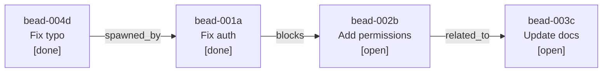

<p align="center">
  <strong>principled-tasks</strong>
</p>

<p align="center">
  <em>SQLite-backed, Git-committed, graph-structured task tracking for principled orchestration.</em>
</p>

<p align="center">
  
  
  
  
</p>

---

A Claude Code plugin that provides persistent, graph-structured task tracking for specification-first development. Tasks (called **beads**, inspired by the Beads methodology) form a directed graph with typed edges — enabling dependency tracking, discovery chains, cross-plan visibility, and natural-language querying via SQLite.

## The Bead Graph

Every piece of trackable work is a **bead** in a directed graph:



Beads track status, agent assignment, plan linkage, and discovery provenance. Edges encode typed relationships: **blocks**, **spawned_by**, **part_of**, and **related_to**.

## Quick Start

```bash
# Install the plugin
claude plugin add <path-to-principled-tasks>

# Create your first task
/task-open "Fix login bug" --plan 003

# Create a blocking dependency
/task-open "Refactor auth module" --blocks bead-0a3f

# Complete a task
/task-close bead-0a3f --notes "Fixed via PR #42"

# Visualize the graph
/task-graph --open --dot

# Audit task health
/task-audit --plan 003

# Ask questions in natural language
/task-query "what tasks are blocked?"
```

## Skills

6 skills: 1 background knowledge + 5 user-invocable slash commands. Each skill is self-contained with its own SKILL.md and scripts.

### Knowledge

| Skill            | Description                                                         |
| ---------------- | ------------------------------------------------------------------- |
| `task-strategy`  | Background knowledge: bead model, schema, edge semantics, patterns  |

### Commands

| Command                                                              | Description                                         |
| -------------------------------------------------------------------- | --------------------------------------------------- |
| `/task-open <title> [--plan NNN] [--blocks <id>] [--discovered-from <id>]` | Create a new bead in the task graph       |
| `/task-close <id> [--notes <text>]`                                  | Close a bead as done or abandoned                   |
| `/task-graph [--plan NNN] [--open] [--dot]`                          | Visualize the bead graph (table or DOT format)      |
| `/task-audit [--plan NNN] [--agent <name>]`                          | Audit graph health: orphans, stale, blocked chains  |
| `/task-query "<question>"`                                           | Natural-language queries against the bead graph     |

## Enforcement Hook

| Hook                  | Event                    | Behavior                                                  |
| --------------------- | ------------------------ | --------------------------------------------------------- |
| DB Integrity Advisory | PreToolUse (Edit\|Write) | Warns on direct `.impl/tasks.db` edits. Advisory (exit 0). |

## Architecture

```
.impl/tasks.db          SQLite database (Git-committed)
  beads                 Task nodes with status, agent, plan
  bead_edges            Typed directed edges between beads
```

### Data Flow

```
/task-open ──→ task-db.sh --open ──→ sqlite3 ──→ .impl/tasks.db ──→ git commit
/task-close ──→ task-db.sh --close ──→ sqlite3 ──→ .impl/tasks.db ──→ git commit
/task-graph ──→ task-db.sh --graph ──→ sqlite3 ──→ stdout (table or DOT)
/task-audit ──→ task-db.sh --audit ──→ sqlite3 ──→ stdout (report)
/task-query ──→ Claude SQL gen ──→ sqlite3 ──→ stdout (results)
```

## Script Duplication

| Script       | Canonical Location                    | Copies                                        |
| ------------ | ------------------------------------- | --------------------------------------------- |
| `task-db.sh` | `skills/task-open/scripts/task-db.sh` | task-close, task-graph, task-audit, task-query |

Drift verified by `scripts/check-template-drift.sh`. Drift = CI failure.

## Dependencies

| Dependency         | Required | Notes                                        |
| ------------------ | -------- | -------------------------------------------- |
| Claude Code v2.1.3+| Yes     | Plugin system with skills                    |
| Bash               | Yes      | All scripts are pure bash                    |
| `sqlite3` CLI      | Yes      | Database operations                          |
| Git                | Yes      | DB committed after every write               |
| `jq`               | No       | Optional — hook falls back to grep           |

## Related

- [principled-docs](../principled-docs/) — Documentation pipeline that produces plans
- [principled-implementation](../principled-implementation/) — Orchestrated plan execution
- [ADR-017](../../docs/decisions/017-sqlite-task-graph.md) — SQLite task graph storage decision
- [RFC-009](../../docs/proposals/009-principled-tasks.md) — Plugin proposal
