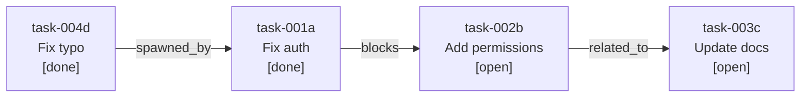

<p align="center">
  <strong>principled-tasks</strong>
</p>

<p align="center">
  <em>Git-native, graph-structured task tracking with an append-only event log for principled orchestration.</em>
</p>

<p align="center">
  
  
  
  
</p>

---

A Claude Code plugin that provides persistent, graph-structured task tracking for specification-first development. Tasks form a directed graph with typed edges — enabling dependency tracking, discovery chains, cross-plan visibility, and natural-language querying via SQLite.

## The Task Graph

Every piece of trackable work is a **task** in a directed graph:


```mermaid
flowchart LR
    A["task-001a\nFix auth\n[done]"]
    B["task-002b\nAdd permissions\n[open]"]
    C["task-003c\nUpdate docs\n[open]"]
    D["task-004d\nFix typo\n[done]"]

    A -->|blocks| B
    B -->|related_to| C
    D -->|spawned_by| A
```

Tasks track status, agent assignment, plan linkage, and discovery provenance. Edges encode typed relationships: **blocks**, **spawned_by**, **part_of**, and **related_to**.

## Quick Start

```bash
# Install the plugin
claude plugin add <path-to-principled-tasks>

# Create your first task
/task-open --title "Fix login bug" --plan 003

# Create a blocking dependency
/task-open "Refactor auth module" --blocks task-0a3f

# Complete a task
/task-close --id task-0a3f --notes "Fixed via PR #42"

# Visualize the graph
/task-graph --status open --format dot

# Audit task health
/task-audit --plan 003

# Ask questions in natural language
/task-query "what tasks are blocked?"
```

## Skills

7 skills: 1 background knowledge + 6 user-invocable slash commands. Each skill is backed by a single shared library at `${CLAUDE_PLUGIN_ROOT}/lib/task-db.sh`.

### Knowledge

| Skill           | Description                                                        |
| --------------- | ------------------------------------------------------------------ |
| `task-strategy` | Background knowledge: task model, schema, edge semantics, patterns |

### Commands

| Command                                                                            | Description                                        |
| ---------------------------------------------------------------------------------- | -------------------------------------------------- |
| `/task-open --title <title> [--plan NNN] [--blocks <id>] [--discovered-from <id>]` | Create a new task in the task graph                |
| `/task-close --id <id> [--notes <text>] [--status done\|abandoned]`                | Close a task as done or abandoned                  |
| `/task-update --id <id> --status <status> [--notes <text>] [--agent <name>]`       | Update status to in_progress or blocked            |
| `/task-graph [--plan NNN] [--status <status>] [--format dot\|text]`                | Visualize the task graph (table or DOT format)     |
| `/task-audit [--plan NNN] [--agent <name>]`                                        | Audit graph health: orphans, stale, blocked chains |
| `/task-query "<question>"`                                                         | Natural-language queries against the task graph    |

## Enforcement Hook

| Hook                  | Event                    | Behavior                                                      |
| --------------------- | ------------------------ | ------------------------------------------------------------- |
| DB Integrity Advisory | PreToolUse (Edit\|Write) | Warns on direct edits to the log or cache. Advisory (exit 0). |

## Architecture

Storage is split between a committed record and a disposable index (ADR-017):

```
.principled/tasks.jsonl   Append-only event log — SOURCE OF TRUTH, committed to Git
  {"op":"open",...}       one JSON object per line, one line per mutation

.impl/tasks.db            SQLite cache — DERIVED, gitignored, rebuilt on demand
  tasks                   Task nodes with status, agent, plan
  task_edges              Typed directed edges between tasks
```

State is the ordered fold of the event log. Delete `.impl/` at any time and
`task-db.sh --sync` reconstructs it exactly.

The log is text and append-only, so two agents working on separate branches append
different lines and Git merges them cleanly. `--init` registers a union merge driver
in `.gitattributes` to make that automatic:

```
.principled/tasks.jsonl merge=union
```

A committed binary database cannot do this — every concurrent write conflicts, which
defeats the purpose of a task graph built for parallel agents.

### Data Flow

```
/task-open   ──→ task-db.sh --open   ──→ append event ──→ rebuild cache ──→ git commit log
/task-close  ──→ task-db.sh --close  ──→ append event ──→ rebuild cache ──→ git commit log
/task-update ──→ task-db.sh --update ──→ append event ──→ rebuild cache ──→ git commit log
/task-graph  ──→ task-db.sh --graph  ──→ query cache   ──→ stdout (table or DOT)
/task-audit  ──→ task-db.sh --audit  ──→ query cache   ──→ stdout (report)
/task-query  ──→ Claude SQL gen      ──→ query cache   ──→ stdout (results)
```

## Shared Code

`lib/task-db.sh` is a single shared copy referenced by every skill as
`${CLAUDE_PLUGIN_ROOT}/lib/task-db.sh`. There are no duplicate copies and no drift
checker to maintain (ADR-018).

## Dependencies

| Dependency          | Required | Notes                                 |
| ------------------- | -------- | ------------------------------------- |
| Claude Code v2.1.3+ | Yes      | Plugin system with skills             |
| Bash 3.2+           | Yes      | Pure bash; runs on stock macOS bash   |
| `sqlite3` CLI 3.38+ | Yes      | Query engine and JSON encoding        |
| Git                 | Yes      | Event log committed after every write |
| `jq`                | No       | Optional — hook falls back to grep    |

## Related

- [principled-docs](../principled-docs/) — Documentation pipeline that produces plans
- [principled-implementation](../principled-implementation/) — Orchestrated plan execution
- [ADR-017](../../docs/decisions/017-event-log-task-graph.md) — Event log as record, SQLite as cache
- [RFC-009](../../docs/proposals/009-principled-tasks.md) — Plugin proposal
